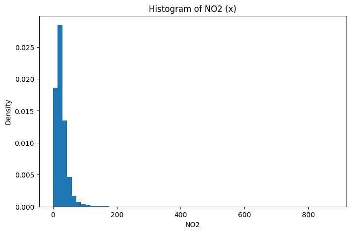
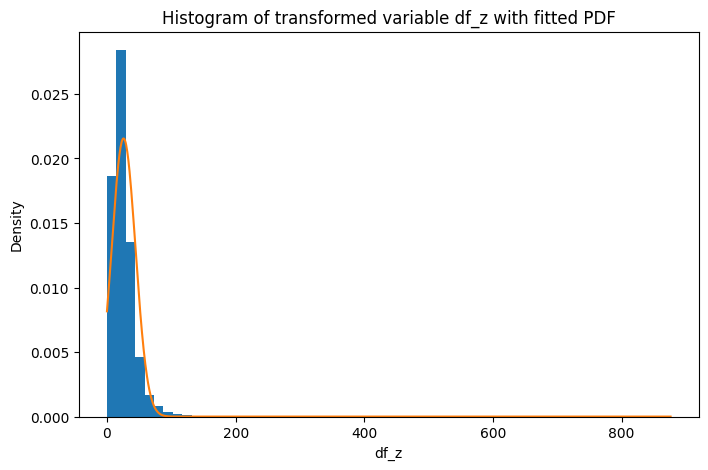

# Learning Probability Density Functions using Roll-Number-Parameterized Non-Linear Model

## Probability Density Function Parameter Learning in Python

**Course:** UCS654 -- Predictive Analytics using Statistics\
**Assignment:** Assignment-3\
**Author:** Nimish Agrawal\
**Roll Number:** 102483077

---

## About the Project

This project implements a roll-number-parameterized nonlinear transformation model to learn the parameters of a probability density function using real environmental air-quality data.
The study uses **NO₂ (Nitrogen Dioxide)** concentration values from the India Air Quality Dataset and estimates the parameters of a Gaussian-type probability density function after applying a nonlinear transformation.

---

## Objective

To transform NO₂ observations using a roll-number-based nonlinear transformation and estimate the parameters $(\lambda, \mu, c)$ of the probability density function:

$$
\hat{p}(z) = c, e^{-\lambda (z-\mu)^2}
$$

---

## Dataset

* Dataset: India Air Quality Data
* Feature Used: NO₂ concentration
* Source: https://www.kaggle.com/datasets/shrutibhargava94/india-air-quality-data

---

## Methodology

### Step 1 — Non-Linear Transformation

Each NO₂ value (x) is transformed into (z) using

$$
z = x + a_r \sin(b_r x)
$$

where

$$
a_r = 0.05(r \bmod 7), \qquad b_r = 0.3((r \bmod 5)+1)
$$

For roll number **102483077**

| Parameter | Value |
| --------- | ----- |
| (a_r)     | 0.20  |
| (b_r)     | 0.90  |

---

### Step 2 — Parameter Estimation

| Parameter              | Estimated Value |
| ---------------------- | --------------- |
| μ (Mean)               | 25.804091       |
| σ (Standard Deviation) | 18.509752       |
| λ                      | 0.001459381     |
| c                      | 0.021553085     |

$$
\lambda = \frac{1}{2\sigma^2}, \qquad
c = \frac{1}{\sigma\sqrt{2\pi}}
$$

---

## Graphical Analysis

### Histogram of Original NO₂ Data

The histogram shows a positively skewed distribution where most observations lie in the lower concentration range while a few high-pollution observations create a long right tail.

---

### Histogram of Transformed Variable with Fitted PDF

The transformed variable distribution becomes smoother and the fitted theoretical probability density curve aligns closely with the central region of the histogram, indicating that the estimated parameters effectively capture the distribution characteristics.

---

## Final Density Function

$$
\hat{p}(z)=0.021553085, e^{-0.001459381(z-25.804091)^2}
$$

---

## Conclusion

The roll-number-parameterized nonlinear transformation successfully generated a transformed dataset suitable for probabilistic modeling.
Statistical estimation techniques enabled learning the parameters of the probability density function directly from environmental data, and graphical comparison confirms that the fitted model provides a good approximation of the transformed NO₂ distribution.
